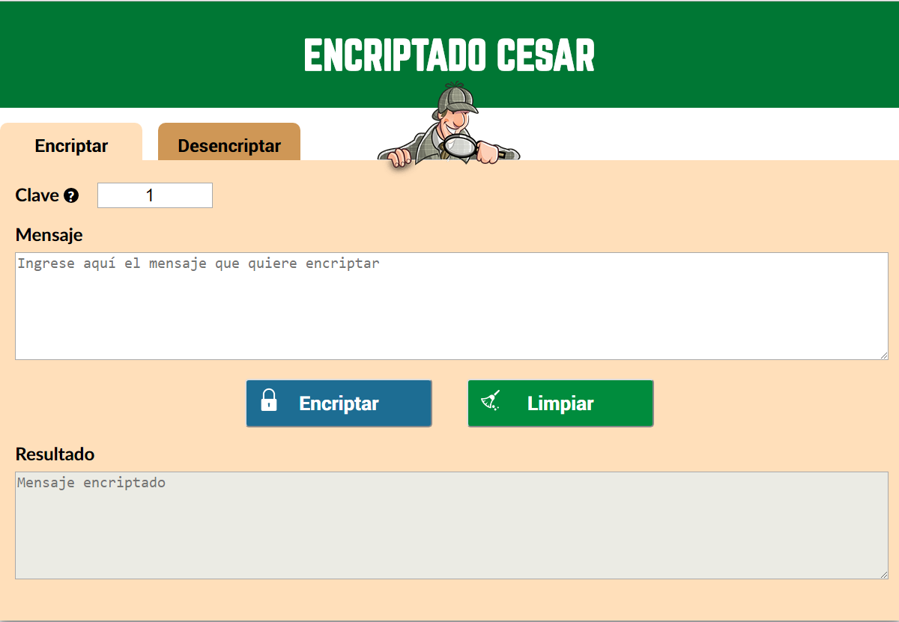
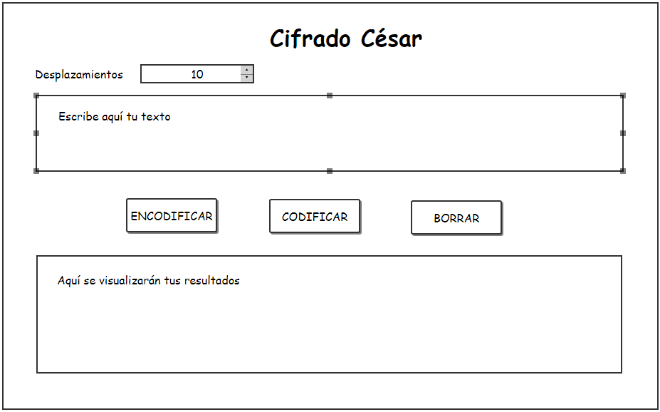
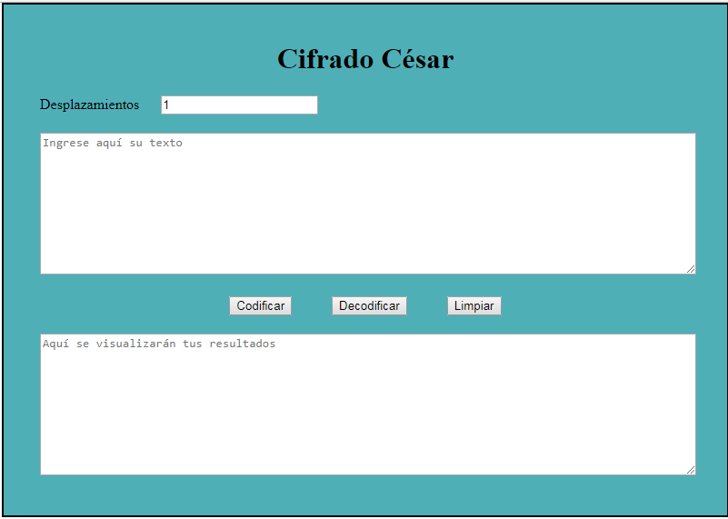
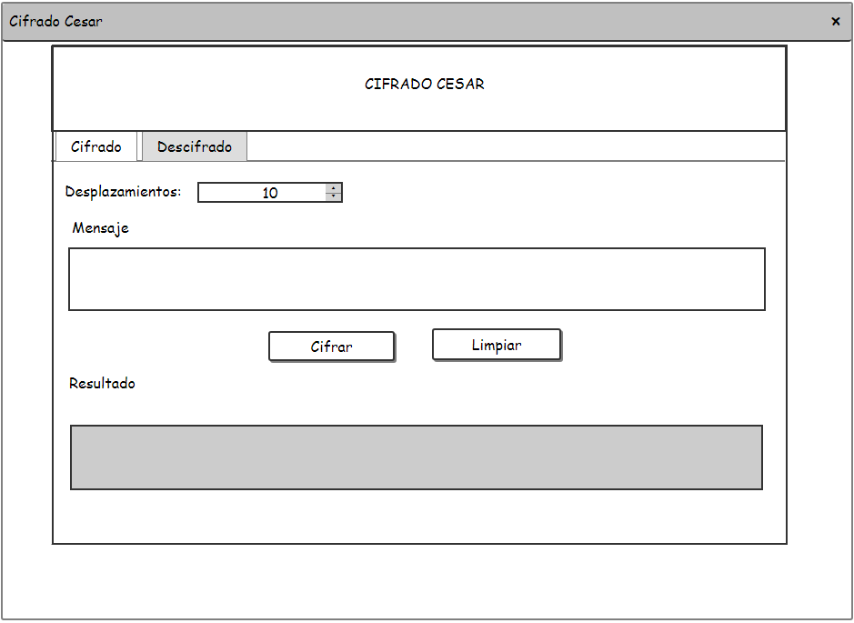
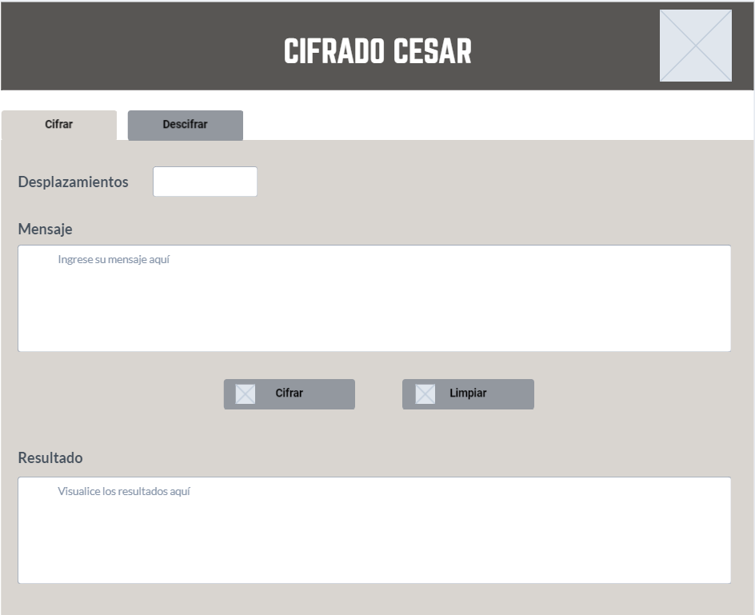
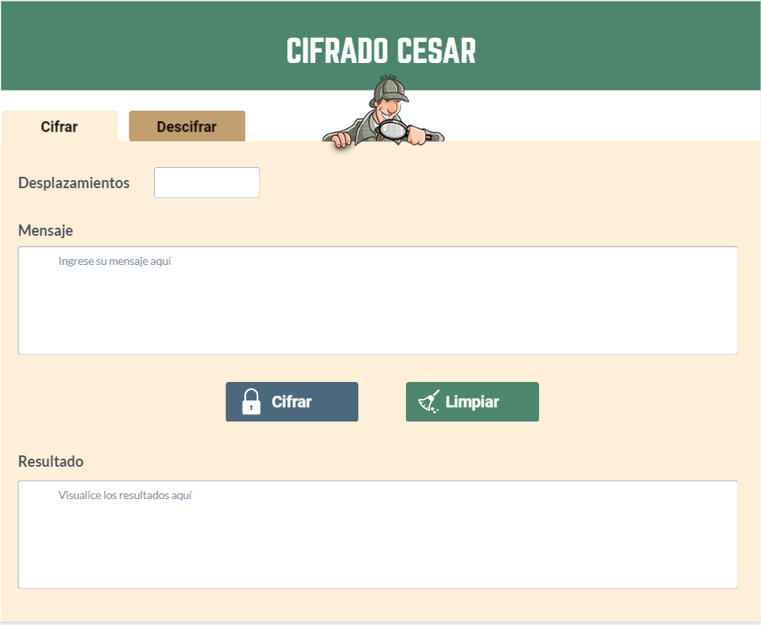
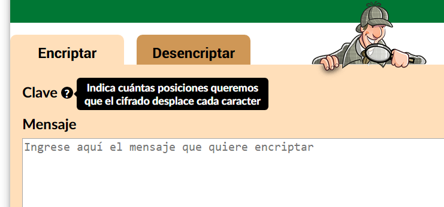

# Definici&oacute;n del producto
Este producto le brinda al usuario la opci&oacute;n de cifrar y descifrar sus mensajes para
poder comunicarse en forma secreta. Para el desarrollo del producto se ha usado como base el cifrado C&eacute;sar.

## ¿Qu&eacute; es el cifrado C&eacute;sar?
El Cifrado de C&eacute;sar es uno de los m&eacute;todos de codificaci&oacute;n conocidos m&aacute;s antiguos. Es muy simple s&oacute;lo se cambian las posiciones del alfabeto. La transformaci&oacute;n se denomina ROTN, donde N es el valor de cambio de posiciones y ROT significa "ROTAR", por que es un cambio c&iacute;clico. Los s&iacute;mbolos no-alfab&eacute;ticos como espacios y d&iacute;gitos no cambian.

## Proceso de definici&oacute;n del producto final a nivel de experiencia y de interfaz.

La distribuci&oacute;n de los objetos en el producto ha sido construida con el fin de que el usuario pueda usarlos de 
manera intuitiva; para ello se ha implementado pestañas para cada funci&oacute;n. aparecer&aacute;n textos descriptivos que indiquen donde debe ingresar 
el usuario sus mensajes as&iacute; como donde el podra visualizar sus resultados. Siendo este el resultado final:

Si bien en la imagen de arriba se aprecia un trabajo logrado este ha tomado varias fases las cuales se pueden apreciar a continuaci&oacute;n:

### Primer boceto
Este lo realic&eacute; solo en base al an&aacute;lisis del problema que se nos plante&oacute;. Use la herramienta quick-mockup.

### Primera version
Implemente la primera versi&oacute;n previo feedback con mi grupo y tratando de cumplir los requerimientos mínimos para realizar una versi&oacute;n entregable.

Al presentarlo recib&iacute; feedback de mi trainig - manager aqu&iacute; me hizo ver que algunos texto no eran lo suficientemente descriptivos y que la posici&oacute;n de los botones le causaba confusi&oacute;n de como flu&iacute;a el proceso de la p&aacute;gina.

### Segundo Boceto
Entonces realiz&eacute; un segundo boceto y para resolver el problema de la confusi&oacute;n del proceso de cifrado con el de descifrado opt&eacute; por ordenar los procesos separandolos uno en cada pesta&ntilde;a donde a cada proceso se les asignar&iacute;a sus respectivos objetos independiente del otro. Opt&eacute; por las pestañas y no por poner dos formularios uno a continuaci&oacute;n del otro (ya sea en forma vertical u horizontal) porque este trabajo se plantea mas que nada para celular y esa clase distribuciones ser&iacute;an poco convenientes.

### Wireframes
Para desarrollar los wireframe use marvel-tool

#### low-fi

#### high-fi

Este &uacute;ltimo prototipo fue implementado y probado all&iacute; se sugiri&oacute; los siguientes puntos:

- Usar la palabra encriptar y desencriptar en vez de cifrar y decifrar(Las primeras resultaban m&aacute;s amigables).
- Usar colores m&aacute;s amigables.
- Hacer los textos aun mas descriptivos, de aquí parti&oacute; la idea de hacer un tooltip para el offset que se ingresar&iacute;a.

## * Principales usuarios de producto

El usuario del producto seria aquella persona que quiera mantener sus mensajes en secreto
en este caso particular serían los invitados a la fiesta sorpresa y yo.

## * Expectativas del usuario en relaci&oacute;n al producto

La expectativa del usuario en relaci&oacute;n al producto es poder comunicarse sin ser descubiertos.

## * c&oacute;mo crees que el producto que est&aacute;s creando les est&aacute; resolviendo sus problemas

El producto resuelve sus problemas ya que hace que sus mensajes sean inintelegibles para el cumpleañero
como para cualquiera que los lee y no sabe de la fiesta sorpresa, como lo hace les permite encodificar
sus mensajes y también les permite decodificarlos usando el cifrado Cesar y d&aacute;ndoles la opci&oacute;n de elegir
con cuantos desplazamientos este se aplicar&aacute;.